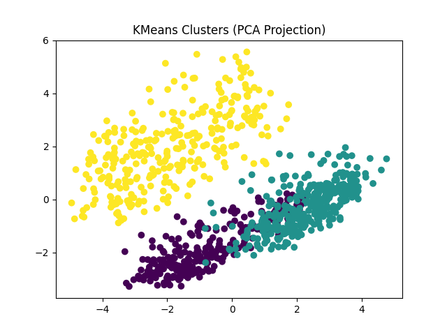
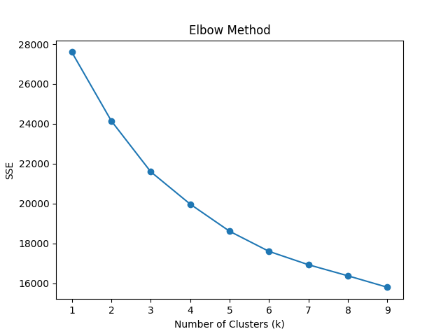
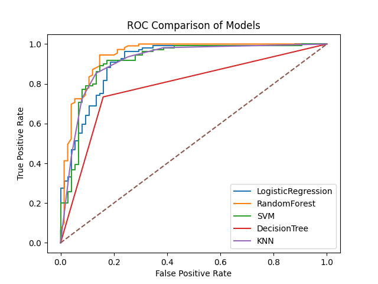
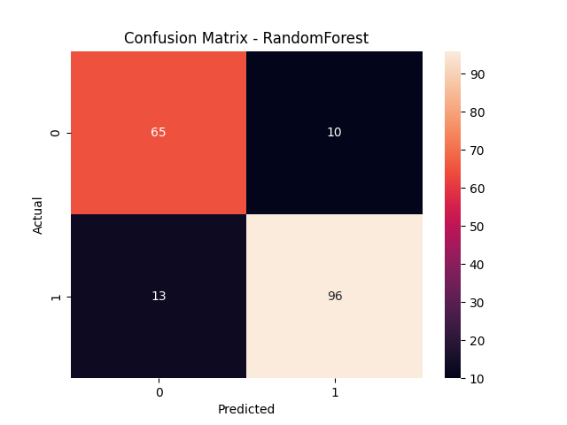

# ❤️ Dự đoán Bệnh Tim - Data Mining Project

Dự án này áp dụng các **kỹ thuật khai phá dữ liệu (Data Mining)** để phân tích và dự đoán nguy cơ **bệnh tim** dựa trên bộ dữ liệu y tế.

Các nội dung chính của dự án:

* Phân tích dữ liệu khám phá (**EDA**)
* Khai phá luật kết hợp (**Association Rules**)
* Phân cụm (**Clustering**)
* Các mô hình phân loại (**Classification Models**)
* Học bán giám sát (**Semi-supervised Learning**)
* Trực quan hóa kết quả mô hình

---

# 📊 Bộ dữ liệu

Bộ dữ liệu sử dụng: **Heart Disease Dataset**

Một số thuộc tính chính:

* Age (Tuổi)
* Sex (Giới tính)
* Chest Pain Type (Loại đau ngực)
* Cholesterol
* Resting Blood Pressure
* Exercise Induced Angina
* Maximum Heart Rate
* ST Depression
* Target (Có/Không mắc bệnh tim)

Số lượng mẫu: **920**

---

# 🧠 Các kỹ thuật Data Mining sử dụng

## 1️⃣ Association Rule Mining (Luật kết hợp)

Sử dụng **thuật toán Apriori** để tìm mối quan hệ giữa các đặc trưng y tế.

Tham số sử dụng:

* min_support = 0.2
* min_confidence = 0.6
* lift > 1.2
* max_len = 2

Ví dụ luật:

```text
exercise_angina = Yes  →  Heart Disease
confidence = 0.72
lift = 1.8
```

Luật này cho thấy bệnh nhân bị **đau thắt ngực khi vận động** có khả năng mắc bệnh tim cao hơn.

---

# 🔍 Phân cụm dữ liệu (Clustering)

Áp dụng **K-Means Clustering** để nhóm các bệnh nhân có đặc điểm y tế tương tự nhau.

Số cụm tối ưu được xác định bằng **Elbow Method**.

### Kết quả phân cụm



### Elbow Method



---

# 🤖 Các mô hình phân loại

Dự án sử dụng nhiều thuật toán Machine Learning để dự đoán bệnh tim:

* Logistic Regression
* Random Forest
* Support Vector Machine (SVM)
* Decision Tree
* K-Nearest Neighbors (KNN)

Các mô hình được đánh giá bằng:

* Accuracy
* F1-score
* ROC-AUC

---

# 📈 So sánh ROC Curve

Đường ROC được sử dụng để so sánh hiệu suất của các mô hình.



---

# 📉 Confusion Matrix

Ma trận nhầm lẫn giúp đánh giá chi tiết kết quả dự đoán.

Ví dụ:



---

# 🔬 Semi-Supervised Learning

Ngoài ra, dự án còn thử nghiệm **Label Spreading** để huấn luyện mô hình khi chỉ có một phần dữ liệu được gán nhãn.

Các tỷ lệ dữ liệu có nhãn được thử nghiệm:

* 5%
* 10%
* 20%

Kết quả được lưu tại:

```text
outputs/tables/semi_supervised_results.csv
```

---

# ⚙️ Cấu trúc project

```text
heart-disease-data-mining

data/
   raw/
      heart.csv

src/
   mining/
   models/
   evaluation/

notebooks/
   eda.ipynb

outputs/
   figures/
   tables/

run_pipeline.py
requirements.txt
README.md
.gitignore
```

---

# 🚀 Cách chạy project

### 1️⃣ Clone repository

```bash
git clone https://github.com/YOUR_USERNAME/heart-disease-data-mining.git
cd heart-disease-data-mining
```

---

### 2️⃣ Cài đặt thư viện

```bash
pip install -r requirements.txt
```

---

### 3️⃣ Chạy pipeline

```bash
python run_pipeline.py
```

Sau khi chạy xong, chương trình sẽ tự động tạo:

```text
outputs/
   figures/
   tables/
```

---

# 📊 Kết quả tạo ra

Các biểu đồ:

* Clustering Visualization
* Elbow Method
* ROC Curve Comparison
* Confusion Matrix

Các bảng dữ liệu:

* Classification Results
* Association Rules
* Semi-supervised Results

---

# 📚 Công nghệ sử dụng

* Python
* Pandas
* NumPy
* Scikit-learn
* MLxtend
* Matplotlib
* Seaborn

---

# 👨‍💻 Tác giả

Nhóm: 4
Sinh viên Công nghệ Thông tin
Lớp: CNTT 17-10
Chuyên ngành: Phát triển phần mềm

---

# ⭐ Mục tiêu dự án

Mục tiêu của dự án là áp dụng các kỹ thuật **Data Mining và Machine Learning** để phát hiện các mẫu dữ liệu và xây dựng mô hình dự đoán **nguy cơ mắc bệnh tim** dựa trên dữ liệu y tế.

---
